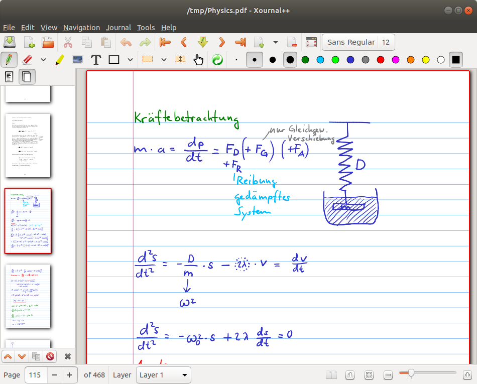
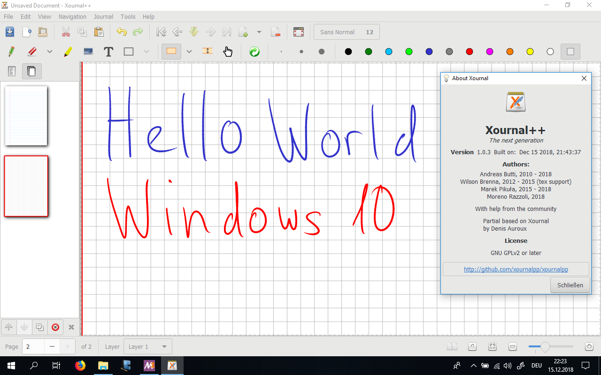
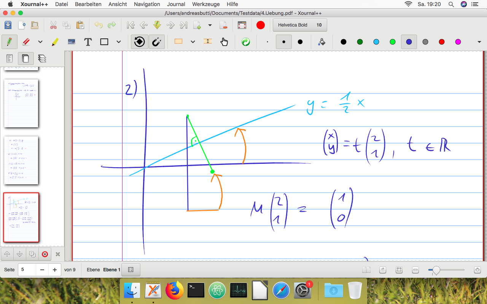
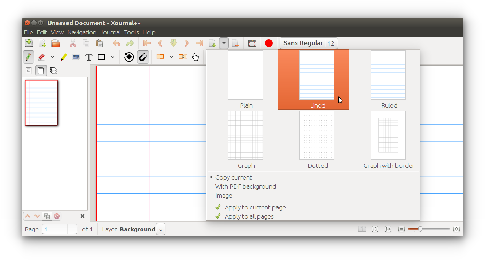
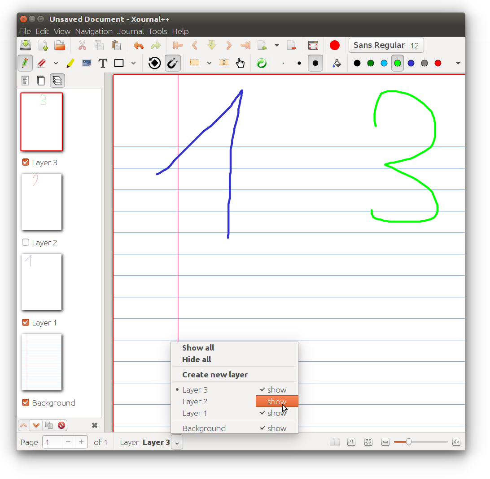
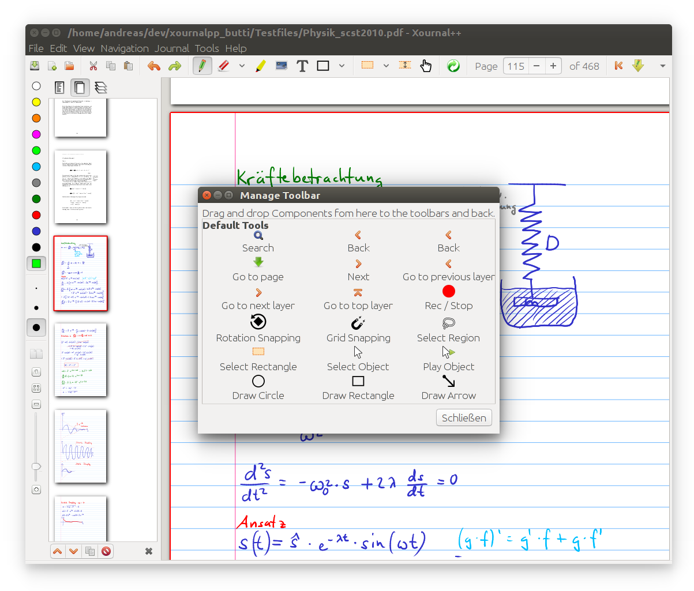
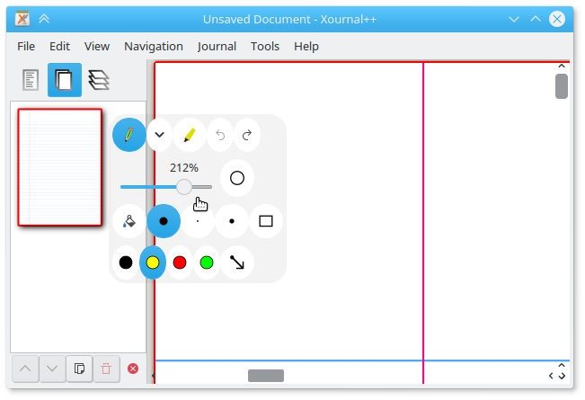
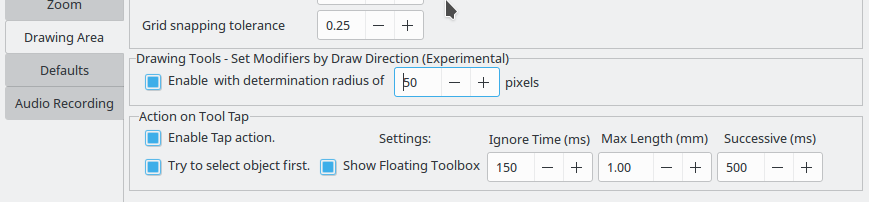

# Xournal++

[](https://dev.azure.com/xournalpp/xournalpp/_build/latest?definitionId=1&branchName=master)
[](https://gitter.im/xournalpp/xournalpp?utm_source=badge&utm_medium=badge&utm_campaign=pr-badge&utm_content=badge)



## Translations

Would you like to see Xournal++ in your own language? Translators are welcome to contribute to Xournal++.

You can contribute translations to the following locations:
* [Crowdin](https://crowdin.com/project/xournalpp/)
* Submit a pull request on GitHub to change:
  * [com.github.xournalpp.xournalpp.appdata.xml](desktop/com.github.xournalpp.xournalpp.appdata.xml)
  * [com.github.xournalpp.xournalpp.desktop](desktop/com.github.xournalpp.xournalpp.desktop)
  * [com.github.xournalpp.xournalpp.xml](desktop/com.github.xournalpp.xournalpp.xml)

Interested in translating a new language? Discuss on [Gitter](https://gitter.im/xournalpp/xournalpp) or create a [new issue](https://github.com/xournalpp/xournalpp/issues) to unlock the language on Crowdin.

**Thanks in advance!**

## Features

Xournal++ (/ˌzɚnl̟ˌplʌsˈplʌs/) is a hand note-taking software written in C++ with the target of flexibility, functionality and speed.
Stroke recognizer and other parts are based on Xournal Code, which you can find at [SourceForge](http://sourceforge.net/projects/xournal/).

Xournal++ features:

- Supports pressure-sensitive styluses and digital pen tables (e.g. Wacom, Huion, XP Pen, etc. tablets)
- Paper backgrounds for note-taking, scratch paper, or whiteboarding
- Annotate on top of PDFs
- Export to a variety of formats including SVG, PNG and PDF, both from the GUI and command line
- Different drawing tools (e.g. pen, highlighter) and stroke styles (e.g. solid, dotted)
- Shape drawing (line, arrow, circle, rectangle, spline)
- Fill shape functionality
- Shape resizing and rotation
- Rotation and grid snapping for precise alignment of objects
- Input stabilization for smoother writing/drawing
- Text tool for adding text in different fonts, colors, and sizes
- Enhanced support for image insertion
- Eraser with multiple configurations
- LaTeX support (requires a working LaTeX installation) with customizable template
- Sidebar containing page previews with advanced page sorting, PDF bookmarks and layers (can be individually hidden/edited)
- Allows mapping different tools/colors etc. to stylus/mouse buttons
- Customizable toolbar with multiple configurations, e.g. to optimize toolbar for portrait/landscape
- Page template definitions
- Bug reporting, auto-save, and auto backup tools
- Audio recording and playback alongside with handwritten notes
- Multi language support (over 20 languages supported)
- Plugins using Lua scripting

## Mobile & web app

Since mid 2020, there is a Flutter-written mobile app for **Android**, **Chrome OS** and **iOS** (coming soon) as well as a **web app** available. Even though it is not perfectly stable nor are all of Xournal++'s features fully supported yet, you may check it out and open your Xournal++ notebooks on your mobile devices. You can get in touch in its [separate repository on GitLab](https://gitlab.com/TheOneWithTheBraid/xournalpp_mobile).

[Get it on Google Play](https://play.google.com/store/apps/details?id=online.xournal.mobile)

The web app is available at [xournal.online](https://xournal.online).

_Why is the iOS app not published yet?_

According to the Apple App Store guidelines, it is prohibited to publish unstable or beta apps. Hence we wait until Xournal++ Mobile works more stable and offers more complete feature compatibility to Xournal++.

<table>
<tr>
<td>

## GNU/Linux


</td><td>

## Windows 10



</td></tr><tr><td>

## macOS Catalina



</td><td>

## Xournal++ Mobile on Chromium OS


</td></tr><tr><td>

## Toolbar / Page Background / Layer

Multiple page background, easy selectable on the toolbar


</td><td>

## Layer sidebar and advanced layer selection



</td></tr><tr><td>

## Multiple predefined and fully customizable toolbars



</td></tr></table>

## User Manual and FAQ

For general usage, consult the [User
Manual](https://github.com/xournalpp/xournalpp/wiki/User-Manual). Answers to
some common questions can be found in the
[FAQ](https://github.com/xournalpp/xournalpp/wiki/Frequently-Asked-Questions-&-Problem-Solving).

## Experimental Features

Sometimes a feature is added that might not be rock solid, or the developers aren't sure if it is useful.
Try these out and give us some feedback.

Here are a few under development that you can play with now:

-  Assign a mouse button or stylus button to bring up a toolbox of toolbars right under the cursor. You can also modify what is in the toolbox through the usual View → Toolbars → Customize although **it won't appear unless you've assigned a button in preferences: mouse or stylus** (or selected a toolbar configuration that uses it).

  - This is an experimental feature because not everything you can put in the toolbox behaves. So be aware.

    

* Keep your eyes out for other experimental features in preferences as seen here:

  DrawingTools: When drawing a box, circle etc, simulate ctrl or shift modifiers by the initial direction you move the mouse.

  Action on Tool Tap: Allow a brief tap on the screen to bring up the floating toolbox and/or select an object. May work with pen and highlighter only.

   

## Installing

The official releases of Xournal++ can be found on the
[Releases](https://github.com/xournalpp/xournalpp/releases) page. We provide
binaries for Debian (Buster), Ubuntu (16.04), MacOS (10.15 and newer), and
Windows. For other GNU/Linux distributions (or older/newer ones), we also provide an
AppImage that is binary compatible with any distribution released around or
after Ubuntu 16.04. For installing Xournal++ Mobile on handheld devices, please check out [Xournal++ Mobile's instructions](https://gitlab.com/TheOneWithTheBraid/xournalpp_mobile#try-it-out)

**A note for Ubuntu/Debian users**: The official binaries that we provide are
only compatible with the _specific version of Debian or Ubuntu_ indicated by the
file name. For example, if you are on Ubuntu 20.04, the binary whose name
contains `Ubuntu-bionic` is _only_ compatible with Ubuntu 18.04. If your system
is not one of the specific Debian or Ubuntu versions that are supported by the
official binaries, we recommend you use either the PPA (Ubuntu only), the Flatpak, or the
AppImage.

There is also an _unstable_, [automated nightly
release](https://github.com/xournalpp/xournalpp/releases/tag/nightly) that
includes the very latest features and bug fixes.

With the help of the community, Xournal++ is also available on official repositories
of some popular GNU/Linux distros and platforms.

### Debian

On Debian bookworm and Debian sid the `xournalpp` package (stable version) is contained in the official repositories. Simply install via

```sh
sudo apt install xournalpp
```

There are also the official [Stable releases](https://github.com/xournalpp/xournalpp/releases) and
_unstable_ [automated nightly releases](https://github.com/xournalpp/xournalpp/releases/tag/nightly).

### Ubuntu and derivatives

On distros based on Ubuntu 22.04 Jammy Jellyfish (and later) the `xournalpp` package (stable version) is contained in the official repositories.
Simply install via

```sh
sudo apt install xournalpp
```

#### Stable PPA
The latest stable version is available via the following [_unofficial_ PPA](https://github.com/xournalpp/xournalpp/issues/1013#issuecomment-692656810):

```sh
sudo add-apt-repository ppa:apandada1/xournalpp-stable
sudo apt update
sudo apt install xournalpp
```

#### Unstable PPA
An _unstable_, nightly release is available for Ubuntu-based distributions via the following PPA:

```sh
sudo add-apt-repository ppa:andreasbutti/xournalpp-master
sudo apt update
sudo apt install xournalpp
```

This PPA is provided by the Xournal++ team. While it has the latest features and
bug fixes, it has also not been tested thoroughly and may break periodically (we
try our best not to break things, though).

### Fedora

The [released version of
xournalpp](https://src.fedoraproject.org/rpms/xournalpp) is available in the
[main repository](https://bodhi.fedoraproject.org/updates/?packages=xournalpp)
via _Software_ application or the following command:

```sh
sudo dnf install xournalpp
```

or

```sh
pkcon install xournalpp
```

The bleeding edge packages synced to xournalpp git master on a daily basis are available from [COPR luya/xournalpp](https://copr.fedorainfracloud.org/coprs/luya/xournalpp/).
[](https://copr.fedorainfracloud.org/coprs/luya/xournalpp/package/xournalpp/)

### openSUSE

On openSUSE Tumbleweed, the released version of Xournal++ is available from the
main repository:

```sh
sudo zypper in xournalpp
```

For openSUSE Leap 15.0 and earlier, use the install link from
[X11:Utilities](https://software.opensuse.org//download.html?project=X11%3AUtilities&package=xournalpp).

For all versions of openSUSE, bleeding edge packages synced to xournalpp git
master on a weekly basis are available from
[home:badshah400:Staging](https://software.opensuse.org//download.html?project=home%3Abadshah400%3AStaging&package=xournalpp).

### Arch Linux

The latest stable release is available [in the [community]
repository](https://www.archlinux.org/packages/community/x86_64/xournalpp/).

To build the latest state of the master branch yourself, use [this AUR
package](https://aur.archlinux.org/packages/xournalpp-git/).

### Solus

The latest stable release is available in the main repository:

```sh
sudo eopkg it xournalpp
```

### Flatpak

The Xournal++ team officially supports a [FlatHub
release](https://flathub.org/apps/details/com.github.xournalpp.xournalpp), which
can be installed with

```sh
flatpak install flathub com.github.xournalpp.xournalpp
```

Note that for Xournal++ to work properly, you must have at least one GTK theme
and one icon theme installed on Flatpak. To enable LaTeX support, you will also
need to install the TeX Live extension:

```sh
flatpak install flathub org.freedesktop.Sdk.Extension.texlive
```

The Flatpak manifest can be found at the [Xournal++ Flatpak packaging
repository](https://github.com/flathub/com.github.xournalpp.xournalpp), and all
Flatpak-related packaging issues should be reported there.

### Android and Chrome OS

Android is supported by Xournal++ Mobile. It can be downloaded either on the [Tags page](https://gitlab.com/TheOneWithTheBraid/xournalpp_mobile/-/tags) or [from Google Play](https://play.google.com/store/apps/details?id=online.xournal.mobile).

### iOS

Unfortunately, the iOS app is not published yet in the Apple App Store. See [here](#mobile--web-app) to learn, why. Anyway, in the [Building section](#building) you can learn how to build an early preview.

### Windows

Official Windows releases are provided on the [Releases
page](https://github.com/xournalpp/xournalpp/releases).

### Mac OS X

Mac OS X releases are provided on the [Releases
page](https://github.com/xournalpp/xournalpp/releases).

**Notes:**

- There have been compatibility problems with Mac OS X Catalina regarding both
  file permissions and stylus support
  ([#1772](https://github.com/xournalpp/xournalpp/issues/1772) and
  [#1757](https://github.com/xournalpp/xournalpp/issues/1757)). Unfortunately,
  we don't have the resources to adequately support Catalina at this time. Help
  would be appreciated!
- Xournal++ will be delivered with a patched GTK. Else, pressure sensitivity will not work on Mac
  [#569](https://github.com/xournalpp/xournalpp/issues/569).

## Building

[GNU/Linux Build](readme/LinuxBuild.md)

[Mac Build](readme/MacBuild.md)

[Windows Build](readme/WindowsBuild.md)

[Android Build](https://gitlab.com/TheOneWithTheBraid/xournalpp_mobile#getting-started)

[iOS Build](https://gitlab.com/TheOneWithTheBraid/xournalpp_mobile#getting-started)

## File format

The file extension `.xopp` is a gzipped XML file. PDFs are not embedded into the file, so if the PDF is deleted, the background is lost. `.xopp` is basically the same file format as `.xoj`, which is used by Xournal. Therefore, Xournal++ is able to read `.xoj` files, and can also export to `.xoj`. As soon as notes are exported to a `.xoj` file, all Xournal++ specific extensions like additional background types, are lost.

`.xopp` files can theoretically be read by Xournal, as long as you do not use any new features. Xournal does not open files that contain new attributes or unknown values, so Xournal++ will add the extension `.xopp` to all saved files to indicate the potential presence of Xournal++-only features.

All new files will be saved as `.xopp`. If an `.xoj` file that was created by Xournal is opened, the Save-As dialog will be displayed on save. If the `.xoj` file was created by Xournal++, the file will be overwritten on save and the file extension will not change.

**We are currently introducing a new file format that can efficiently store attached PDF files and other attachments internally. We will still allow for attachments that are linked to external files. Please refer to [#937](https://github.com/xournalpp/xournalpp/issues/937) for further details.**

## Building

We support building on three operating systems:

- [Linux](readme/LinuxBuild.md)
- [MacOS](readme/MacBuild.md)
- [Windows](readme/WindowsBuild.md)

## Contributing

See [CONTRIBUTING.md](./CONTRIBUTING.md)
