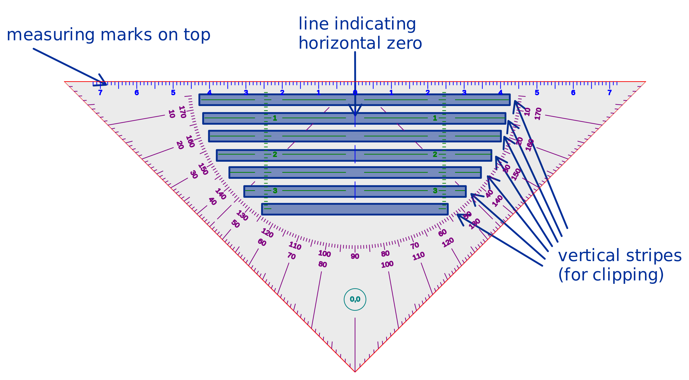
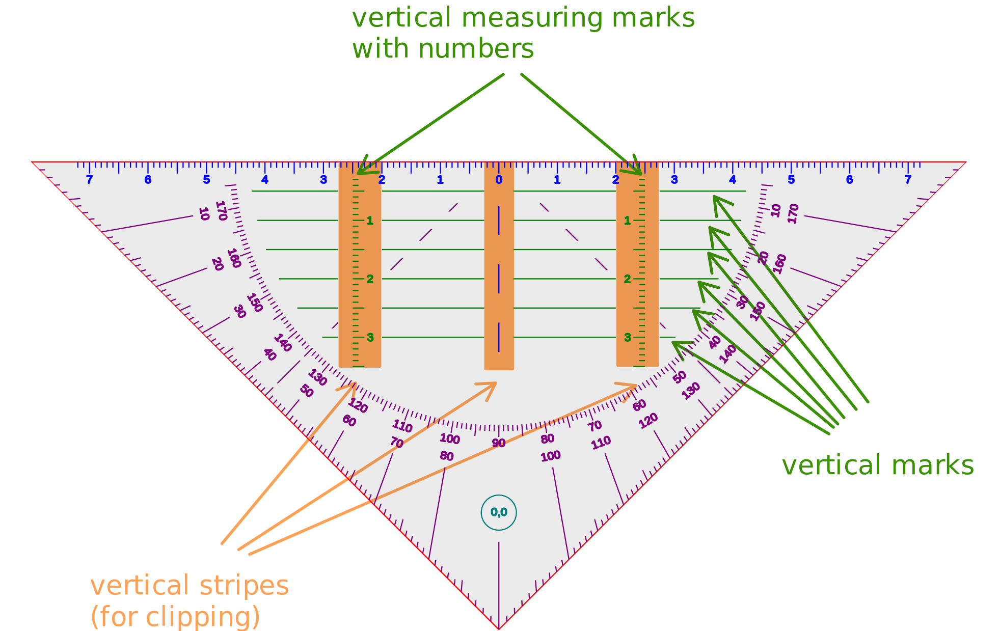
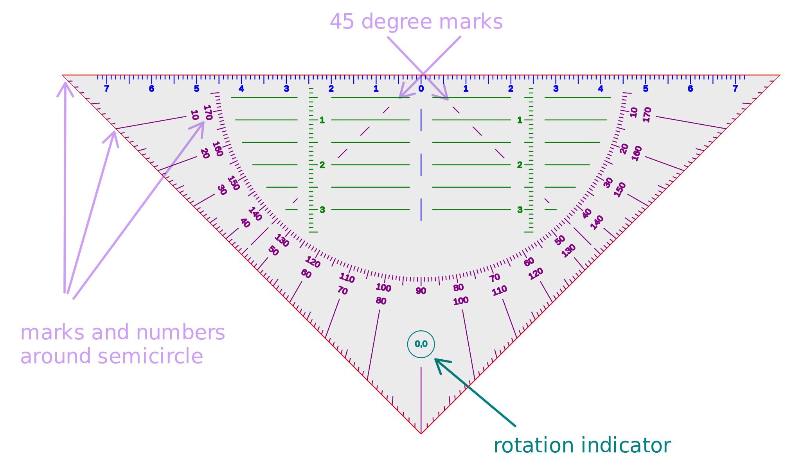
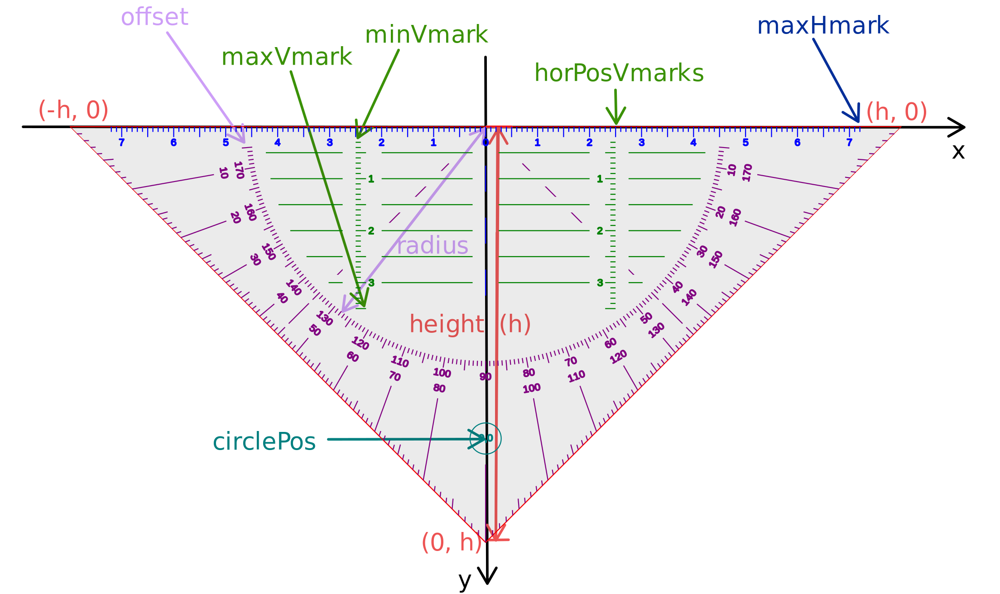

# Setsquare Readme

## Setsquare handling

- **Switch on/off** either from menu `Edit > Setsquare` or via the toolbar (setsquare symbol)
- The setsquare can be used for measuring length and angles and for geometric constructions. Check your Display DPI Callibration in the Zoom panel of menu `Edit > Preferences` to have length on your screen match physical length.
- It is designed to be used either with touch (one hand) and stylus/mouse (other hand) or with keyboard (one hand) and stylus/mouse (other hand)
- **Keyboard and Touch** are used to move the setsquare (and the page) around, to rotate it and change its size, whereas **Stylus/Mouse** are used to draw/annotate and in particular to draw lines at the longest side of the setsquare.
- **Keyboard** (use Alt modifier to get smaller steps):
  - arrow keys for moving around. Steps are 0.25 cm (big) and 0.25 mm (small). Use the shift key to make the setsquare move parallel or perpendicular to the longest side of the setsquare.
  - r/R for rotation (countclockwise/clockwise) around the midpoint of the longest side of the setsquare. Steps are 5 degrees (big) and 0.2 degrees (small)
  - s/S for scaling (up/down) from the midpoint of the longest side of the setsquare. Steps for scaling up are 10% (big) and 1% (small). Scaling down has the opposite effect.
- **Touch** can be used with one finger or two fingers. Gestures with more fingers are not handled.
  - One finger touch:
    - Touch and move inside the setsquare to move the setsquare around. If you move the middle point of the longest side of the setsquare close to some line segment, the setsquare will get rotation snapped to it, if its rotation angle is at most 3 degrees from the one of the line segment (or of a perpendicular line). This is useful in geometric constructions (when you want to draw a perpendicular line or a line in a specific angle from an existing line) and for measuring angles between line segments.
    - Touch and move outside the setsquare to move the whole page including the setsquare around
  - Two fingers touch: The rotation and scaling centers are the midpoint between the two fingers. The action depend on where you put your first finger and partly also where you put the second finger.
    - A touch sequence with two fingers, where the first finger touching the screen is outside the setsquare, acts in the usual way (for zooming and scrolling the whole page)
    - A touch sequence with two fingers, where both fingers are placed inside the setsquare is used for simultaneous scrolling/rotating/resizing. Currently the zoom gesture preferences from the Touchscreen panel in menu `Edit > Preferences` are also applied for the resizing operation. I would recommend to set the percentage to something like 50% to avoid unintended resizing.
    - A touch sequence with two fingers, where the first finger touching the screen inside the setsquare and the second finger outside the setsquare leads to scrolling/resizing without rotation (and also no rotation snapping).
- **Stylus/Mouse** interact with the Pen, Highlighter and Hand tool
  - Pen/Highlighter:
    - Start a stroke inside the setsquare, not further than 0.5 cm from its longest side, to draw a line aligned to the longest side of the setsquare. It doesn't matter what drawing type you use.
    - Start a stroke inside the setsquare, not further than 0.5 cm from one of the shorter sides, but outside the above mentioned region, to get a line from the chosen point to the midpoint of the longest side of the setsquare.
    - Start a stroke outside the two regions described above to get normal drawing. This can be used for annotation, but also to draw lines from one of the angular marks to the center of the longest side (which is often used for geometric constructions) using the "Draw Line" drawing type.
  - Hand tool:
    - Use it in the inside of the setsquare to move the setsquare only.
    - Use it on the outside of the setsquare to move the whole page including setsquare

- There is also a display of the current angle (in tenth of degrees) between the longest side of the setsquare and a horizontal axis. The number always looks up.

## Implementation details for Setsquare drawing

The setsquare drawing is devided into several steps. First the outline is drawn, then the horizontal marks, vertical marks, angular marks and the rotation indicator. Some of these drawing functions use clipping of horizontal or vertical stripes. All of that, including the user coordinate system and variables used for drawing, is depicted in the following images:

### Horizontal marks and clipping stripes

### Vertical marks and clipping stripes

### Angular marks and rotation indicator

### User coordinate system and variables used for drawing

