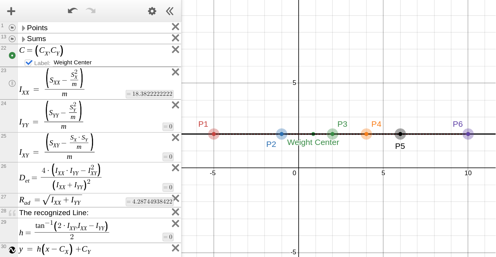

# Shape Recognizer
This is a trial to decipher the shape recognition algorithm that was implemented in `C` +10 years ago, and its implementer seems to have lost interest in maintaining it. This trial may -or may not- help in improving the accuracy of the algorithm. 

⚠️ Don't take it as a final version, but as a starting point to understand the algorithm and its implementation. If you have any suggestions or improvements specially in the mathematical part, please don't hesitate to share them.

NOTE: All geometric calculations and images are generated using [Desmos](https://www.desmos.com/calculator), Desmose doesn't support importing and exporting its graphs, so the links of the graphs are provided instead:
- [SR_Line](https://www.desmos.com/calculator/rp3ygo3ccf)
- [SR_Circle](https://www.desmos.com/calculator/uhao4lbwxc)

*Contents of the class [Explored so far]:*
- [Inertia](#inertia)

## [Inertia.{h, cpp}](Inertia.h)
This class `Inertia` in `Inertia.{h, cpp}` utilizes the scientific connection between the covariance matrix in statistics and the moment of inertia in physics. 
### 1. $I_{xx}$, $I_{yy}$ Variance in $x$ and $y$ (Moment of Inertia Around Axes):
- Found in `Inertia::xx()` and `Inertia::yy()` respectively.
- The formula for the moment of inertia along the $x$-axis is
$$
I_{xx}​=\frac{1}{m}\cdot (∑m_i\cdot x_i^2​−\frac{(∑m_i\cdot x_i​)^2​}{m}) \\
$$
- The formula for the moment of inertia along the $y$-axis is
$$
I_{yy}​=\frac{1}{m}\cdot (∑m_i\cdot y_i^2​−\frac{(∑m_i\cdot y_i​)^2​}{m})
$$

#### Key Components:

##### Variance Terms $(∑m_i\cdot x_i^2​)$​ and $(∑m_i\cdot y_i^2)​$:

  * These terms measure the weighted squared distances of the points from the origin component-wise (along the $x$ and $y$ axes).
  * They represent how "spread out" the points are along each axis.

##### Centering Term $(\frac{(∑m_i\cdot x_i​)^2​}{m})$ and $(\frac{(∑m_i\cdot y_i​)^2​}{m})$:
  * This corrects for the mass-weighted mean (center of mass), ensuring the moment is relative to the center of mass instead of the origin.
  * Without this term, the formula would represent the moment of inertia relative to the global origin `Point(0,0)`.
  * When the points are centered around a point like the center of a circle, the centering term ensures that the moment of inertia is normalized and scale invariant.

### 2. $I_{xy}$ Covariance in $x$ and $y$:
- Found in `Inertia::xy()`.
- The formula for the moment of inertia around the $x$ and $y$ axes is:

$$I_{xy}​=\frac{1}{m}\cdot (∑m_i\cdot x_i\cdot y_i​−\frac{(∑m_i\cdot x_i​)\cdot(∑m_i\cdot y_i​)}{m})$$

#### Key Components:
##### Covariance Term $(∑m_i\cdot x_i\cdot y_i​)$:
* This term measures the joint variability between the $x$ and $y$ components of the points.
##### Centering Term $(\frac{(∑m_i\cdot x_i​)\cdot(∑m_i\cdot y_i​)}{m})$:
* Ensures that the covariance is measured relative to the center of mass, not the global origin.

Positive covariance means $x$ and $y$ vary together, negative covariance indicates inverse variation, and zero covariance means no relationship between $x$ and $y$ components.

##### Significance of Value:
* $I_{xy} > 0$: Points cluster along a positively sloped diagonal (e.g., from bottom-left to top-right).
* $I_{xy}<0$: Points cluster along a negatively sloped diagonal (e.g., from top-left to bottom-right).
* $I_{xy}=0$: Points are either symmetric (e.g., circular) or aligned purely along one axis.

<!-- Some Examples -->
#### Examples:
1) Effect of spreading the points along the $x$-axis:
   

    
 

  

    <em>Figure SR1</em>: A compact, perfect horizontal line.
 

  - $I_{xx}$ increases as the points spread out along the $x$-axis, while $I_{yy}$ remains zero as the points are aligned perfectly along the $x$-axis.
  - $I_{xy}$ remains zero as the points are aligned along the $x$-axis and there is zero covariance between $x$ and $y$.
  - The center of weight is the real one not the origin `Point(0,0)` (with some steady state error as the last point dosen't have weight by design) because of the centering term.
  - $Rad = 0.1$ which is negligible (should be zero) and it is radius of the circle if it is a circle. Rad is to be discussed in a later section.
  - h is the recognized slope of the line (demonstrated in the figure by the Black line) which is $0$ in this case.
2) Effect of spreading the points along the $y = -x$ line:
  

    
 

  

    <em>Figure SR2</em>: A loosly aligned set of points along the y = -x line.
  

 - $I_{xx}$ and $I_{yy}$ increase as the points spread out along both of $x$ and $y$ axes.
  - $I_{xy}$ increases as the points spread out along both of $x$ and $y$ axes, and the covariance between $x$ and $y$ is negative.
  - h is the recognized slope of the line (demonstrated in the figure by the Black line) which is $-0.7$ in this case.

